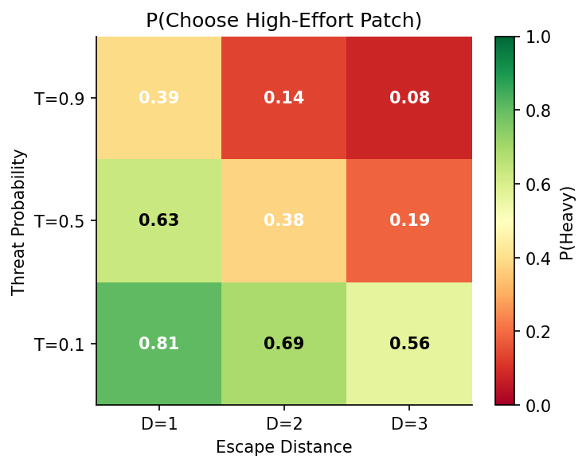

# Result 101 — Threat probability and distance both reduce P(heavy)

## Overview

Do humans reduce their high-effort foraging when predation risk and travel distance increase, as risk-sensitive foraging theory predicts? We tested this with a logistic regression of trial-level choice on threat probability and heavy-cookie distance in two independent online samples. Both predictors reduced the probability of choosing the high-effort cookie in both samples, with effects of similar magnitude and a significant negative interaction — distance becomes a stronger deterrent under high threat. The finding establishes the core behavioral phenomenon: human choice in this task is jointly governed by an environmental risk variable and an action-cost variable, and motivates the model-comparison work that follows.

## Hypothesis

**Statement.** "High-effort choices will decrease with threat probability and distance." (Preregistration, H1a.)

**Predicted direction.** β(threat) < 0 AND β(distance) < 0.

**Preregistered criterion.** Both p < .01 with negative sign.

**Source of the hypothesis.** Preregistration §H1a (`write-up/preregistration.md`, lines 18–22). Motivated by optimal foraging under predation theory (Bednekoff 2007; Brown 1999): if effort cost and predation risk both reduce expected fitness, a fitness-maximizing agent should reduce its rate of high-effort, high-exposure choices as either quantity increases.

## Data Source

- **Samples:** Exploratory N = 290 (after exclusions, from 350 collected), data dir `data/exploratory_350/processed/stage5_filtered_data_20260403_133425`. Confirmatory N = 281 (after exclusions, from 350 collected), data dir `data/confirmatory_350/processed/stage5_filtered_data_20260403_142413`.
- **Input file (both samples):** `behavior_rich.csv` per sample directory — trial-level behavior including `choice` (1 = heavy, 0 = light), `threat` (in {0.1, 0.5, 0.9}), `distance_H` (distance of the heavy cookie, in {1, 2, 3}), and `subj`.
- **Inclusion / exclusion applied for this result:** Project-default exclusions only (incomplete data, calibration outliers, escape rate < 35%). Only choice trials retained (`beh['type'] == 1`).
- **Unit of analysis:** Trial (within subject), with cluster-robust SE by subject.
- **N entering the model:** ~13,050 choice trials, exploratory; ~12,645 choice trials, confirmatory (45 choice trials per subject × N subjects).

## Method

For each sample, a logistic regression of trial-level choice on z-scored threat probability, z-scored heavy-cookie distance, and their interaction was fit with cluster-robust standard errors (clustering by subject). `threat_z` and `dist_z` are standardized within sample. The interaction term captures whether the deterrent effect of distance amplifies or attenuates at higher threat. The model returns three coefficients of interest plus an intercept; the preregistered test concerns the signs and significance of the two main effects.

**Model specification:**

```python
smf.logit(
    "choice ~ threat_z + dist_z + threat_z:dist_z",
    data=beh
).fit(disp=False, cov_type='cluster', cov_kwds={'groups': beh['subj']})
```

**Software / packages:**
- `statsmodels` (formula API + cluster-robust covariance)
- `scipy.stats.zscore` for predictor standardization
- Environment: `effort_foraging_threat` (Python 3.11)

**On cluster-robust standard errors.** The same subject contributes ~45 choice trials, and within-subject choices are correlated (a person who is generally effort-averse will choose light cookies repeatedly; one who is risk-averse will avoid high-threat trials repeatedly). A naive logistic regression that treats every trial as an independent observation therefore underestimates the true standard errors and produces inflated z-statistics. Cluster-robust SEs (the Liang–Zeger sandwich estimator with `groups = subj`) correct for arbitrary within-subject correlation of residuals without requiring a parametric random-effects specification: the coefficient point estimates are unchanged, but the SEs are inflated to reflect the effective sample size. This choice trades parsimony for a slightly looser inference than a mixed-effects logit (which would also model the variance components explicitly) but is robust to misspecification of the random-effects covariance structure. Given the very large z-statistics observed here (|z| > 19 for both main effects in both samples), any reasonable inferential framework would yield the same conclusion.

**Inference criterion:** Each main effect must satisfy β < 0 AND p < .01.

**Notebook that produces this result:** `notebooks/analysis/H1_adaptive_shifts.ipynb`, cell 2 (the H1a logistic fit). Validated 2026-05-23: re-executed end-to-end, outputs match the values below to 4 decimal places.

## Result

Both threat probability and distance reduce the probability of choosing the heavy cookie, in both samples. The threat × distance interaction is also negative, indicating that at high threat the deterrent effect of distance is amplified.

| Term | Exploratory (N=290) | Confirmatory (N=281) |
|---|---|---|
| Intercept | −0.431 (SE 0.067, z = −6.44, p = 1.2 × 10⁻¹⁰) | −0.466 (SE 0.066, z = −7.09, p = 1.4 × 10⁻¹²) |
| β(threat_z) | **−1.015** (SE 0.046, z = −22.28, **p = 5.7 × 10⁻¹¹⁰**) | **−0.908** (SE 0.046, z = −19.80, **p = 2.8 × 10⁻⁸⁷**) |
| β(dist_z) | **−0.747** (SE 0.032, z = −23.69, **p = 4.3 × 10⁻¹²⁴**) | **−0.666** (SE 0.030, z = −22.05, **p = 8.8 × 10⁻¹⁰⁸**) |
| β(threat_z × dist_z) | −0.195 (SE 0.024, z = −8.02, p = 1.1 × 10⁻¹⁵) | −0.116 (SE 0.025, z = −4.72, p = 2.4 × 10⁻⁶) |

**Figure (notebook-generated PNG, inline preview):**



Each panel is a 3 (threat) × 3 (distance) grid; cell color = mean P(heavy) in that condition, ranging green (P→1) to red (P→0). Both panels show the same monotonic gradient: top-left (low threat, near distance) is high-P; bottom-right (high threat, far distance) is low-P.

**Paper-grade figure:** `results/figs/paper/fig_h1a_choice.pdf` (vector version of the same panels, used in manuscript).

**Verdict on prereg criterion:** **PASS** in both samples. β(threat) < 0 and β(distance) < 0 with p ≪ .01 throughout.

## Interpretation

Both threat probability and distance to the heavy cookie suppress the probability of choosing it, with effects of comparable magnitude and the same sign in two independent samples. Each one-SD increase in threat multiplies the odds of choosing heavy by ≈ 0.36 (exploratory) or ≈ 0.40 (confirmatory) — a 2.5–2.8× reduction in odds per SD. Distance is of similar size (odds multipliers ≈ 0.47 and ≈ 0.51 per SD). The same sign, comparable magnitude, and overwhelming significance across both samples indicate that the phenomenon replicates beyond sampling variation in the Prolific population.

This pattern is the central prediction of risk-sensitive foraging theory (Brown 1999; Bednekoff 2007). An organism foraging under predation should reduce its rate of high-effort, high-exposure choices as either the probability of attack or the duration of exposure increases, because both quantities lower the expected fitness payoff of the foraging attempt. The two predictors are conceptually distinct — one a property of the environment (T), the other a property of the chosen action (D) — yet they converge on the same downstream quantity: the probability of safe return. The negative threat × distance interaction (|z| > 4.7 in both samples), in which distance becomes a stronger deterrent at higher threat, is consistent with this shared dependence: when the baseline probability of escape is already compressed by high T, additional reductions from longer travel become disproportionately costly.

The result establishes that human choice in this task is jointly governed by an environmental risk variable and an action-cost variable, in a manner that mirrors the basic logic of risk-sensitive foraging. It does not, on its own, adjudicate among candidate mechanisms by which threat and effort are integrated; whether the combination is best described by a survival-weighted value computation, an additive cost-of-fear term, or a hybrid is the question taken up in the model-comparison results in [[result_201]].

## Caveats & Limitations

- **Threat and distance are statistically independent by design (fully crossed within block), but the deterrent effect of each is partly mediated by the same survival computation.** A logistic regression with both as additive predictors does not attribute the variance to a mechanism — it shows only that both matter on the choice surface. The mechanistic attribution comes from the fitted joint model in [[result_201]], where threat enters only through S(u) and distance enters through both S(u) and the demand-cost term.
- **The interaction term was not preregistered as a primary test.** Although the prereg model specification included the interaction (`threat_z:dist_z`), only the two main effects were named as hypothesis tests with explicit criteria. The interaction is reported here as descriptive of the choice surface; its theoretical interpretation (compressed survival amplifies the cost of additional distance) is licensed by the prereg theory but the test itself is post-hoc.
- **Cluster-robust SEs assume only that residuals are independent across subjects, not across trials within a subject.** This is the right assumption for a within-subject repeated-measures design. The same conclusions would hold with a mixed-effects logit (a random intercept by subject); we use cluster-robust SEs for transparency and to avoid having to defend a particular random-effects covariance structure when the effect sizes are this large.
- **Reward magnitudes are fixed and known to participants.** This result speaks to choice behavior given the specific reward-effort-threat structure of this task, not to how participants might respond if rewards varied trial-to-trial or were uncertain. Generalization to natural foraging is an extrapolation.
- **Online sample.** Participants completed the task in a web browser on their own hardware. Calibration is performed per-subject and per-block to absorb hardware and fatigue variability, but variance from this source cannot be fully eliminated. The fact that effects replicate across two independent Prolific samples with overlapping CIs is the best available evidence that this source of noise does not drive the findings.

## Replication

**To regenerate this result from scratch:**

```bash
PYTHONPATH=notebooks/analysis \
  jupyter nbconvert --to notebook --execute \
  notebooks/analysis/H1_adaptive_shifts.ipynb \
  --inplace --ExecutePreprocessor.kernel_name=python3 \
  --ExecutePreprocessor.timeout=600
```

Run from the project root. `PYTHONPATH` is required so the notebook's local imports (`config`, `load_data`) resolve when the kernel is launched by `nbconvert` from outside `notebooks/analysis/`.

**Expected runtime:** ~30 s on CPU.

**Expected outputs:**
- Notebook re-saved in place with executed cell outputs in `notebooks/analysis/H1_adaptive_shifts.ipynb`.
- The H1a table (above) appears in cell 2's stdout output.
- Figure regenerated at `results/figs/paper/fig_h1a_choice.pdf`.

## References

**Related results (forthcoming):**
- [[result_102]] — Affect responds to threat and distance (prereg H1b).
- [[result_103]] — Within-cookie vigor increases with threat (prereg H1c).
- [[result_201]] — Joint fitness model M4 (the computational account that explains why both threat and distance suppress heavy-cookie choice).

**Notebook:**
- `notebooks/analysis/H1_adaptive_shifts.ipynb` — produces this and all other H1 results.

**Literature:**
- Bednekoff, P. A. (2007). Foraging in the face of danger.
- Brown, J. S. (1999). Vigilance, patch use and habitat selection: foraging under predation risk.
