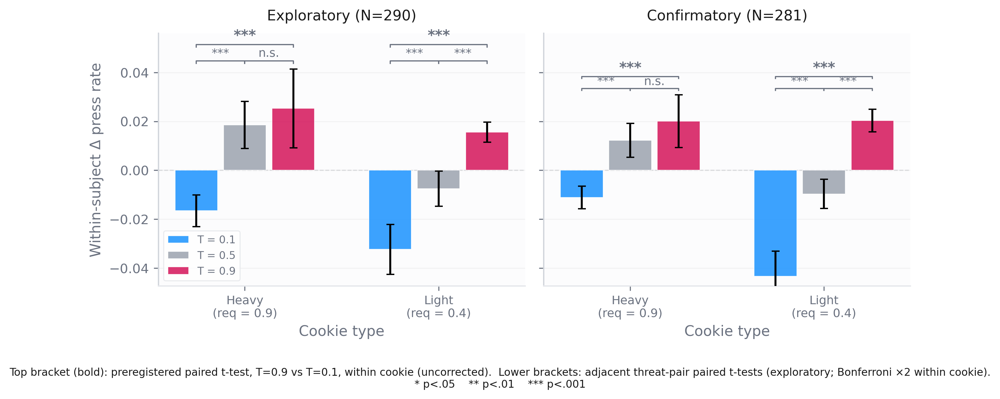
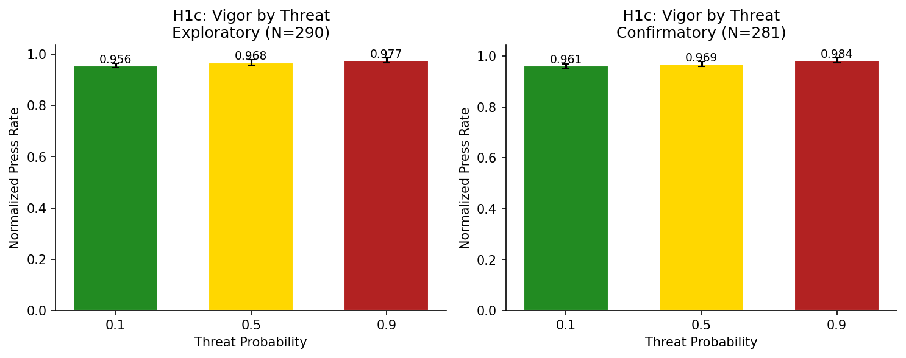

# Result 103 — Within-cookie pressing rate rises with threat probability

## Overview

Does motor execution intensify under threat even when the cookie chosen is held fixed? On every **free-choice trial** we recorded inter-keypress intervals during the transport phase and computed a normalized pressing rate (median(1/IPI) divided by the calibration maximum). The preregistered test fixes cookie identity and asks whether vigor at T = 0.9 exceeds vigor at T = 0.1, separately within heavy and light. We use two complementary analyses: (i) the **preregistered** paired t-test within each cookie type (restricted to type==1 free-choice trials, the natural reading of the prereg's "chosen effort level"), and (ii) a complementary linear mixed-effects model that pools across cookies at the trial level. The preregistered test PASSES in all four cells (2 cookies × 2 samples) with effect sizes Cohen's d_z ≈ 0.33–0.61 and p < 10⁻⁵. The cookie asymmetry is robust and replicates: light-cookie d_z is consistently larger than heavy-cookie d_z (≈ +0.49–0.61 vs ≈ +0.33–0.37). One further pattern emerges from the adjacent-step analysis: within heavy cookies, vigor rises sharply from T = 0.1 → T = 0.5 but **saturates** between T = 0.5 and T = 0.9 in both samples (n.s.); within light cookies, vigor rises step-by-step across all three threat levels. A supplementary distance analysis (on the broader all-trials dataset) reveals a small positive effect of chosen distance on vigor and — unexpectedly — a **negative** threat × distance interaction (the opposite of the predatory-imminence prediction), preferred by ΔAIC ≈ 10 in both samples. The finding establishes that threat shifts not only what people choose but how hard they press once they have chosen, with informative structure: the effect saturates for heavy choosers (a self-selected high-effort subgroup) and is attenuated rather than amplified by distance.

## Hypothesis

**Statement.** "Within each chosen effort level, pressing intensity will increase with threat." (Preregistration, H1c.)

**Predicted direction.** Mean normalized press rate at T = 0.9 > T = 0.1, within each cookie type.

**Preregistered criterion.** Paired t-test on within-subject mean rate (T = 0.9 − T = 0.1), separately within heavy and light cookies, p < .01 in both comparisons.

**Source of the hypothesis.** Preregistration §H1c (`write-up/preregistration.md`, line 221). Motivated by predatory imminence theory and risk-sensitive foraging: under elevated threat, an organism that has already committed to a foraging attempt should execute that attempt at higher vigor to compress exposure time, even though the chosen action is unchanged.

**Scope.** The prereg's phrase "chosen effort level" implies free-choice trials (type==1). The main analysis is therefore restricted to type==1 trials; some subjects who never chose a given cookie at one of the threat extremes are not estimable for that cell. The supplementary distance analysis uses the broader all-trials dataset (free-choice + probes) since that is the only place enough variation in chosen distance exists to test distance effects.

## Data Source

- **Samples:** Exploratory total N = 290; confirmatory total N = 281 (same exclusions as result_101).
- **Input file (both samples):** `behavior_rich.csv` and `trial_vigor.csv` per sample, filtered to valid pressing-rate measurements (`vigor_valid`).
- **Inclusion / exclusion applied for this result:**
  - *Main paired-t (preregistered):* type==1 free-choice trials only; per-cookie cell requires both T = 0.1 and T = 0.9 valid trials for inclusion. Per-cookie Ns: heavy 223 (exploratory) / 205 (confirmatory); light 238 / 235. Subjects who never chose a given cookie at one of those threats are not estimable for that cell.
  - *Main LMM (complementary):* same type==1 filter, trial-level, ~12,941 (exploratory) and ~12,452 (confirmatory) trials.
  - *Supplementary distance LMMs:* all valid pressing trials (free-choice + probes), ~23,288 (exploratory) and ~22,434 (confirmatory) trials.
- **Unit of analysis:**
  - *Paired-t:* Subject, with per-subject mean `norm_rate` at T = 0.1 and T = 0.9, separately within heavy and light.
  - *LMM:* Trial, with subject random intercept.

## Method

For each sample we ran **two complementary tests** of the same effect, on the type==1 (free-choice) subset:

**1. Paired t-test within cookie (PRIMARY, preregistered).** For each cookie type separately, we computed each subject's mean `norm_rate` at T = 0.1 and T = 0.9, then ran a paired t-test on the within-subject difference (T = 0.9 − T = 0.1). Effect size is Cohen's d_z (mean of difference / sd of difference); the 95% confidence interval is computed on the mean difference. This is the exact test specified in the preregistration.

**2. LMM with cookie covariate (complementary).** A single linear mixed-effects model pooled across both cookies (still type==1 only):

```python
smf.mixedlm(
    "norm_rate ~ threat_z + is_heavy",
    data=vigor_valid_type1,
    groups=vigor_valid_type1['subj']
).fit(reml=False)
```

The threat coefficient is the per-SD shift in trial-level pressing rate after partialling the cookie-mean difference.

**Why both.** The two tests answer slightly different questions about the same effect:

| Question | Test |
|---|---|
| Does the threat → vigor effect hold *separately* within each cookie? | **Paired-t** (preregistered) |
| Is there a smooth per-SD threat slope at the trial level, after partialling cookie? | **LMM** (complementary) |

The paired-t naturally surfaces any cookie asymmetry; the LMM aggregates over it to give a single coefficient.

**Normalized pressing rate.** Defined as `median(1 / IPI) / calibrationMax`. Values can exceed 1.0 when a subject momentarily presses faster than during calibration — this occurs more often at high threat (see Result).

**Software / packages:**
- `scipy.stats.ttest_rel` (paired t)
- `statsmodels.mixedlm` (ML estimation via `reml=False`)
- Environment: `effort_foraging_threat` (Python 3.11)

**Inference criterion:** PASS if paired-t Δ > 0 with p < 0.01 in both cookies, in both samples.

**Notebook that produces this result:** `notebooks/analysis/H1_adaptive_shifts.ipynb`, cell 7 (main) and the supplementary cell (Models A, B, C). Validated 2026-05-28.

## Result

The preregistered paired-t PASSES in all four cells. Effect sizes show a clear and replicated cookie asymmetry, and the adjacent-step analysis reveals a saturation pattern for heavy.

### Test 1 — Paired t-test within cookie (PRIMARY, preregistered)

| Cookie | Sample | N | mean(T=0.1) | mean(T=0.9) | Δ [95% CI] | t (df) | p | Cohen's d_z | Verdict |
|---|---|---|---|---|---|---|---|---|---|
| **Heavy** | Exploratory | 223 | 0.987 | 1.031 | **+0.045** [+0.029, +0.061] | t(222) = +5.54 | **8.7 × 10⁻⁸** | **+0.371** | **PASS** |
| **Heavy** | Confirmatory | 205 | 0.977 | 1.010 | **+0.034** [+0.020, +0.048] | t(204) = +4.71 | **4.5 × 10⁻⁶** | **+0.329** | **PASS** |
| **Light** | Exploratory | 238 | 0.908 | 0.958 | **+0.050** [+0.037, +0.063] | t(237) = +7.51 | **1.2 × 10⁻¹²** | **+0.487** | **PASS** |
| **Light** | Confirmatory | 235 | 0.917 | 0.983 | **+0.066** [+0.052, +0.080] | t(234) = +9.37 | **6.4 × 10⁻¹⁸** | **+0.611** | **PASS** |

All four prereg-named tests pass (Δ > 0, p < 0.01). Light-cookie d_z (≈ +0.49–0.61) is consistently larger than heavy-cookie d_z (≈ +0.33–0.37) — the cookie asymmetry replicates in both samples. The per-cookie Ns differ from the full sample because subjects who never chose a particular cookie at one of T = 0.1 or T = 0.9 are not estimable for that cell.

### Test 2 — LMM with cookie covariate (complementary)

| Term | Exploratory (n_trials=12,941) | Confirmatory (n_trials=12,452) |
|---|---|---|
| **β(threat_z)** | **+0.0208** (z = +12.61, **p = 1.9 × 10⁻³⁶**) | **+0.0181** (z = +12.83, **p = 1.2 × 10⁻³⁷**) |
| β(is_heavy) | +0.0566 | +0.0496 |

The trial-level threat slope is small in absolute units (~2 percentage points of calibrated capacity per SD of threat) and highly reliable. The LMM's |z| > 12 (smaller than before with the broader all-trial sample but still very robust) comes from ~12,500 free-choice trials per sample and confirms the threat effect is not an artifact of any per-cookie aggregation in the paired-t.

### Descriptive condition means (no covariate adjustment, type==1 only)

| Threat (T) | Exploratory mean (SE) | Confirmatory mean (SE) |
|---|---|---|
| 0.1 | 0.956 (0.004) | 0.961 (0.004) |
| 0.5 | 0.968 (0.005) | 0.969 (0.005) |
| 0.9 | 0.977 (0.005) | 0.984 (0.005) |

A monotonic rise across the three threat levels in both samples *when pooled across cookies*. The within-cookie structure (Figure 1) is more informative.

### Figures

**Figure 1 — Within-subject Δ press rate by cookie × threat (type==1, with preregistered test and adjacent-level comparisons annotated).**



Each bar shows the mean within-subject deviation from that subject's mean `norm_rate` in that cookie type; error bars are 95% CIs on the across-subject mean.

**Bracket annotations.** The **bold top bracket** in each cookie group is the **preregistered paired t-test** (T = 0.9 vs T = 0.1, uncorrected). All four cells pass at `***` (p < 0.001). The **two lower brackets** are exploratory adjacent-level paired t-tests, Bonferroni-corrected ×2 within cookie. These adjacent tests are not preregistered; they're annotated to make the step-wise pattern visible.

**What the brackets reveal.**
- **Heavy:** the T = 0.1 → T = 0.5 step is `***` in both samples, but the **T = 0.5 → T = 0.9 step is `n.s.`** in both samples. **Within the self-selected high-effort subgroup (subjects who chose heavy at each threat level), the threat → vigor relationship saturates above T = 0.5.** This is consistent with a calibration ceiling: heavy-cookie pressing at high threat is already approaching the per-subject maximum, leaving no headroom to climb further.
- **Light:** all three pairwise steps are `***` in both samples. The light-cookie effect is monotonic across the full range, consistent with light-cookie pressing sitting well below the calibration ceiling.

**Figure 2 — Raw condition means by threat level (type==1, descriptive companion).**



Pooled across cookies on type==1 free-choice trials. The three threat levels are 0.956 → 0.968 → 0.977 in the exploratory sample and 0.961 → 0.969 → 0.984 in the confirmatory sample. This panel is useful as a descriptive overview; the within-subject view in Figure 1 is what the preregistered test actually evaluates.

**Verdict on prereg criterion:** **PASS** in both samples and both cookies (paired-t with Δ > 0, p < 0.01 in all four cells). LMM agrees (β > 0, p ≪ 0.01).

### Supplementary — distance and threat × distance interaction

The preregistered H1c test fixes cookie identity and pools across distance. Predatory imminence theory predicts that vigor should also rise with **distance** (longer exposure to flee through) and that the **threat × distance interaction** should be positive (effect of threat amplified at longer distance — more exposure to compress). We tested both predictions with three further LMMs on the broader all-trials dataset (~23,000 trials per sample, free-choice + probes). These analyses are **exploratory** — they are not in the prereg.

**Data semantics caveat.** `trial_vigor.csv`'s `distance` column stores the trial's `distance_H` (the heavy option's distance), not the *chosen* cookie's pressed distance. We compute **`chosen_distance`** explicitly: `distance_H if cookie==1 else distance_L`. For light, `chosen_distance` is always 1 (light cookies are always at D=1); for heavy, `chosen_distance ∈ {1,2,3}` in free-choice trials and =1 in probes. The distance slope in any pooled model is therefore identified entirely from heavy-cookie variation.

| Term | Exploratory (n=23,288) | Confirmatory (n=22,434) |
|---|---|---|
| **Model A** — `norm_rate ~ threat_z + chosen_dist_z + is_heavy + (1\|subj)` | | |
| β(threat_z) | **+0.0188** (z=+16.95, p=2.0 × 10⁻⁶⁴) | **+0.0173** (z=+17.85, p=2.9 × 10⁻⁷¹) |
| β(chosen_dist_z) | **+0.0029** (z=+2.42, p=0.015) | **+0.0047** (z=+4.50, p=6.9 × 10⁻⁶) |
| β(is_heavy) | +0.0444 (z=+18.71, p=4.1 × 10⁻⁷⁸) | +0.0357 (z=+17.07, p=2.5 × 10⁻⁶⁵) |
| **Model B** — Model A + `threat_z × chosen_dist_z` | | |
| β(threat_z × chosen_dist_z) | **−0.0046** (z=−3.53, **p=4.2 × 10⁻⁴**) | **−0.0039** (z=−3.51, **p=4.5 × 10⁻⁴**) |
| ΔAIC (B − A) | **−10.44 (B preferred)** | **−10.30 (B preferred)** |
| **Model C** — heavy-only `norm_rate ~ threat_z + dist_z + (1\|subj)` | | |
| β(threat_z) [heavy only] | +0.0161 (z=+10.30, p=6.9 × 10⁻²⁵) | +0.0155 (z=+11.01, p=3.6 × 10⁻²⁸) |
| β(dist_z) [heavy only] | +0.0044 (z=+2.86, p=4.2 × 10⁻³) | +0.0052 (z=+3.69, p=2.3 × 10⁻⁴) |
| n_trials [heavy only] | 10,733 | 10,161 |

Three findings:

1. **The threat → vigor effect is robust to distance adjustment.** β(threat_z) in Model A is essentially unchanged from the main type==1 LMM in Test 2 once the broader sample is used (+0.019 / +0.017 vs +0.021 / +0.018). The preregistered threat finding is not driven by a confound with distance, and replicates on the broader sample.

2. **Chosen distance has a small positive effect on vigor.** β(chosen_dist_z) ≈ +0.003 (exploratory) and +0.005 (confirmatory), both p < 0.02. The effect is small but replicated; it is identified entirely from heavy-cookie variation (light is constant at D=1) and is confirmed by the heavy-only Model C (β ≈ +0.004–0.005, p < 0.005 in both samples).

3. **The threat × distance interaction is NEGATIVE and replicated.** β(threat × distance) = −0.0046 (exploratory) / −0.0039 (confirmatory), both p < 5 × 10⁻⁴, ΔAIC favoring Model B by ~10 in both samples. **This is the *opposite* of the predatory-imminence prediction**: at longer distance, the threat slope on vigor is *smaller*, not larger. The most parsimonious mechanistic reading is the calibration ceiling — at high threat and long distance, heavy-cookie pressing is already pinned near its per-subject maximum, so the marginal effect of additional threat at long distance is compressed. The data are consistent with vigor responding to threat *probability* primarily, with distance modulating the *headroom* available rather than amplifying urgency.

## Interpretation

Pressing rate rises with threat probability holding chosen cookie fixed, in both samples and both cookies. Three threads are worth drawing out, with one of them reframed substantially by the new analysis.

**1. The effect is real and replicates within the preregistered analysis.** The paired-t — the test named in the prereg — passes in all four cells (2 cookies × 2 samples) at p < 10⁻⁵. Confirmatory effect sizes are close to exploratory: heavy d_z = +0.37 vs +0.33; light d_z = +0.49 vs +0.61. The LMM provides an independent trial-level confirmation with a single coefficient (β ≈ +0.018–0.021 per SD of threat) and |z| > 12 in both samples. The two tests converge on PASS.

**2. The cookie asymmetry is itself a finding, and within heavy the effect saturates above T = 0.5.** Light-cookie d_z (~+0.49–0.61) is consistently larger than heavy-cookie d_z (~+0.33–0.37) — the ratio is roughly 1.4–1.9× across samples. We interpret this as a structural ceiling effect: heavy-cookie pressing requires ~90% of calibrated maximum by design, so there is limited headroom for threat to push the rate higher. Light-cookie pressing requires ~40%, leaving substantial headroom. **The within-heavy adjacent-step analysis confirms this directly:** the T = 0.1 → T = 0.5 step is large and significant in both samples (`***`), but the T = 0.5 → T = 0.9 step is **n.s.** in both samples — within the self-selected subgroup who chose heavy at each threat level, vigor *saturates* above T = 0.5. The light cookie shows monotonic step-by-step rises (`***` for every adjacent comparison). This is not a self-selection artifact: it is the *prereg-relevant* pattern, restricted to "subjects who freely chose heavy at this threat level" — which is exactly the population the prereg names.

**3. Distance attenuates rather than amplifies the threat-vigor relationship.** The supplementary analysis revealed a small positive main effect of chosen distance on vigor (β ≈ +0.003–0.005, replicated) but, more strikingly, a **negative threat × distance interaction** (β ≈ −0.004, p < 10⁻³ in both samples; ΔAIC ≈ −10). This goes against the predatory-imminence prediction that longer exposure should amplify urgency. The most parsimonious mechanistic reading is, again, the calibration ceiling: at high threat and long distance, heavy-cookie pressing is already pinned near maximum, so additional distance no longer leaves room for further threat-driven escalation. The data are consistent with vigor responding to threat *probability* first, with distance setting the available *headroom* rather than amplifying urgency.

The result establishes that threat shifts vigor within cookie but does not, on its own, distinguish whether the vigor adjustment is calibrated to the survival benefit it actually buys, whether it is driven by anticipatory affect, or whether choice and vigor are governed by a single underlying value computation. Those questions are addressed by the joint fitness model in [[result_201]] (which predicts an optimal pressing rate per condition), by the affect-to-vigor null tests (internal H9: no trial-level affect → vigor coupling), and by the choice-vigor coupling analyses in the 400 block ([[result_401]], [[result_404]]).

## Caveats & Limitations

- **Calibration ceiling bounds the absolute size of the threat → vigor shift and shapes the saturation pattern.** Mean `norm_rate` at T = 0.9 within heavy cookies exceeds 1.0 — subjects momentarily press faster than they did during calibration. This implies the calibration phase did not fully capture each subject's peak capacity, and that threat-induced vigor is running into the calibration ceiling on high-threat heavy trials. The light-cookie effect (d_z ≈ +0.49–0.61) is therefore likely the cleaner estimate of the underlying threat → vigor sensitivity; the heavy-cookie effect (d_z ≈ +0.33–0.37) is attenuated by the ceiling, which also explains both the within-heavy T = 0.5 → 0.9 saturation and the negative threat × distance interaction.
- **Per-cookie Ns vary in the paired-t.** Subjects who never chose a given cookie at one of T = 0.1 or T = 0.9 are not estimable for that cell. Per-cookie Ns: heavy 223 / 205; light 238 / 235 (out of 290 / 281 total). This is part of the prereg's scope, not an exclusion — the test is about subjects who actually engaged with this cookie at both threat extremes. The two cookies' tests therefore use overlapping but not identical subject samples.
- **The two tests are not statistically independent.** The paired-t and the LMM use the same observations; reporting both is not double-confirmation but two views on one effect.
- **The threat × cookie interaction is descriptive in the paired-t, not formally tested in a single model.** A `norm_rate ~ threat_z * is_heavy + (1|subj)` extension would quantify this; given the |z| > 12 main effect, the interaction is unlikely to overturn the main finding but would put a number on the cookie asymmetry.
- **Random-intercept-only LMM.** Adding random slopes on threat by subject would absorb additional heterogeneity but is not currently fit. Given the |z| > 12 result, this is unlikely to change the LMM conclusion.
- **Pressing rate is a transport-phase aggregate.** The single-number `norm_rate` per trial collapses over the within-trial timecourse. Phase-resolved vigor effects are taken up in the 300 block ([[result_302]], [[result_307]]).
- **`chosen_distance` is identified by heavy trials only.** Light cookies are always presented at D=1, so the distance main effect and the threat × distance interaction in Models A and B are estimated entirely from heavy-cookie variation. Model C (heavy-only) confirms this. The pooled model uses light trials only to anchor the cookie main effect and subject intercepts.

## Replication

**To regenerate this result from scratch:**

```bash
# 1. Run the statistics notebook (paired-t + LMM + supplementary; saves Figure 2)
PYTHONPATH=notebooks/analysis \
  jupyter nbconvert --to notebook --execute \
  notebooks/analysis/H1_adaptive_shifts.ipynb \
  --inplace --ExecutePreprocessor.kernel_name=python3 \
  --ExecutePreprocessor.timeout=600

# 2. Regenerate the paper-grade within-subject figure (Figure 1)
python scripts/plotting/plot_h1.py
```

Run both from the project root. `PYTHONPATH` is required so the notebook's local imports (`config`, `load_data`) resolve when the kernel is launched by `nbconvert` from outside `notebooks/analysis/`.

**Expected runtime:** ~30 s for the notebook (same notebook as result_101 and result_102; all three results run in one pass); ~5 s for the plotting script.

**Expected outputs:**
- Notebook cell 7 stdout reports: (a) condition means by threat level (type==1); (b) per-cookie paired-t with Δ, 95% CI, t, p, and Cohen's d_z (PRIMARY); (c) LMM threat coefficient with z and p (COMPLEMENTARY). Heading clearly states `(type==1 free-choice trials)`.
- Supplementary cell stdout reports Model A (`+ chosen_dist_z`), Model B (`+ threat_z:chosen_dist_z`), and Model C (heavy-only) coefficients, p-values, and ΔAIC. Sanity-checks that `chosen_distance` is in {1} for light and {1,2,3} for heavy.
- Figure 1 (within-subject Δ by cookie × threat, type==1, with significance brackets) regenerated at `results/figs/h1/h1c_vigor_by_threat.{png,pdf}` by `plot_h1.py`.
- Figure 2 (raw means by threat, type==1) regenerated at `results/figs/paper/H1c_vigor_by_threat.png` by notebook cell 8.

## References

**Related results:**
- [[result_101]] — Choice ~ threat + distance. The choice-side companion: same gradient, different behavioral channel.
- [[result_102]] — Affect ~ threat + distance. The affect-side companion. Together with this result and result_101, completes the H1 triad of threat-driven adaptive responses.
- [[result_201]] — Joint fitness model M4. The computational account that predicts an optimal pressing rate per condition.
- [[result_302]] — Trial-level survival → vigor LMM (internal H6 partial result).
- [[result_401]] — Population-level marginal coupling between choice and vigor; the M4-era replacement for the deprecated β-dissociation story.

**Notebook:**
- `notebooks/analysis/H1_adaptive_shifts.ipynb` — produces this and the other H1 results.

**Literature:**
- Fanselow, M. S., & Lester, L. S. (1988). A functional behavioristic approach to aversively motivated behavior: predatory imminence as a determinant of the topography of defensive behavior.
- Mobbs, D. (2018). The ethological deconstruction of fear(s).
