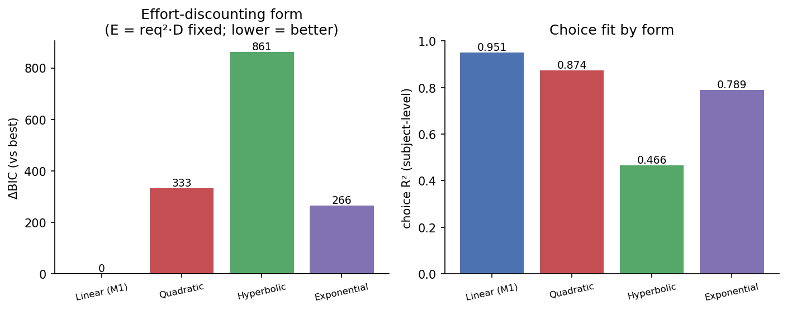

# Result 206 — Effort enters choice as linear discounting of a quadratic energy term (E = req²·D)

> **Supersedes the deprecated FET result.** An earlier version of result_206 documented an effort-discounting comparison inside the deprecated FET (effort-discounting + threat-bias) framework, where an *exponential* discount on reward won. That framework has been replaced by the joint fitness model (M1/M4). This entry re-runs the discount-form question inside the **current M1 specification** and the headline reverses: with effort held as the theory-motivated energy term `E = req²·D`, a **linear** discount fits best. See Revision notes.

## Overview

Within the joint fitness framework, the effort-only null model M1 says option value equals reward minus a cost term in the energy `E = req²·D` (quadratic instantaneous press cost × duration). But which *functional form* should discount reward by `E` — linear, quadratic, hyperbolic, or exponential? We fit four otherwise-identical M1 variants with equal parameter counts and compared by ΔBIC, in both samples. A **linear** discount on `E` wins decisively (ΔBIC ≥ 266 over every alternative in both samples), with identical form ordering across samples and subject-level choice R² ≈ 0.95 (vs ≤ 0.87 for any alternative). The result establishes M1's linear-discount-of-quadratic-energy as the principled null model that the joint M4 ([[result_201]]) is compared against in [[result_202]].

## Hypothesis

**Statement.** Within the effort-only null model M1, the function that trades reward against effort is best described by a linear discount on the energy term `E = req²·D`, rather than by a quadratic, hyperbolic, or exponential discount of the same term.

**Predicted direction.** Lowest BIC for the linear form.

**Preregistered criterion.** Model selection by ΔBIC (equal parameter counts across forms).

**Source of the hypothesis.** Supplemental model-selection check that motivates M1's effort term (and, through it, M4's quadratic deviation cost). Replaces the deprecated FET discount-form selection (internal H2).

## Data Source

This result is now fit on both samples.

**Exploratory (N = 293 subjects):**
- Built 2026-05-29 from `data/exploratory_350/processed/stage5_filtered_data_20260403_133425/` via `scripts/preprocessing/prepare_model_input.py`.
- `data/model_input_exploratory/choice_trials.csv` — 13,185 choice trials.
- `data/model_input_exploratory/vigor_cell_means.csv` — 3,935 condition-cell means.
- `data/model_input_exploratory/subject_mapping.csv` — 293 subjects.
- N_obs (model selection): 13,185 + 3,935 = **17,120 likelihood contributions**, 293 subjects.

**Confirmatory (N = 281 subjects):**
- Built 2026-05-29 from `data/confirmatory_350/processed/stage5_filtered_data_20260403_142413/`.
- `data/model_input_confirmatory/choice_trials.csv` — 12,645 choice trials.
- `data/model_input_confirmatory/vigor_cell_means.csv` — 3,822 condition-cell means.
- `data/model_input_confirmatory/subject_mapping.csv` — 281 subjects.
- N_obs: 12,645 + 3,822 = **16,467 likelihood contributions**, 281 subjects.

**Unit of analysis (both samples):** Choice likelihood at the trial level; vigor likelihood at the condition-cell-mean level (intercept-only null, identical across all variants).

## Method

The analysis isolates a single design question: **how should reward be discounted by effort in the choice model?** All other structure is held fixed at the M1 null specification (per-subject log-normal κ, free population softmax temperature τ, and an intercept-only "null" vigor likelihood that carries no condition structure). The effort/cost argument is fixed at the theory-motivated energy term `E = req²·D` — quadratic instantaneous press cost × duration — which is exactly M1's cost term and is consistent with M4's quadratic deviation cost. Only the **discount function** that converts `(R, E)` into an option value is varied, across four candidate forms with **equal parameter counts**, so the BIC comparison is clean. Each option's value drives a softmax choice; `ΔV = V_H − V_L` and `P(heavy) = σ(ΔV / τ)`.

**Discount-function variants (Axis B — the headline):**

```
E = req² · D            (fixed; req_H=0.9, req_L=0.4, D_H∈{1,2,3}, D_L=1 ⇒ E_H=0.81·D_H, E_L=0.16)
R_H = 5, R_L = 1

Linear (current M1) : V = R − κ·E
Quadratic           : V = R − κ·E²
Hyperbolic          : V = R / (1 + κ·E)
Exponential         : V = R · exp(−κ·E)

per-subject:  κ_i = exp(m_κ + s_κ · z_i),  z_i ~ N(0,1)
choice:       P(heavy) = σ((V_H − V_L) / τ),  τ free
vigor:        intercept-only null (identical across all four variants)
```

**Supplemental robustness check (Axis A — effort exponent on `req`):** A separate sweep varies the exponent `p` in `cost = κ·req^p·D` (discount held linear), with `p=1` (the M4 choice "total-demand" form), `p=2` (the M1 quadratic form used in Axis B), and `p` estimated freely. This sweep is secondary: it moves BIC far less than the discount-function choice and the free optimum is not interpretable (see Result).

**Model selection.** BIC = 2·(−ELBO) + k·ln(N_obs), with k = N_S + 6 population parameters (m_κ, s_κ, μ_vigor, b_cookie, σ_v, τ; the free-power variant adds 1). Per-sample: k = 299 / N_obs = 17,120 (exploratory); k = 287 / N_obs = 16,467 (confirmatory). Equal k across the four Axis-B forms ⇒ ΔBIC reduces to a pure ELBO comparison within each sample.

**Software / packages:**
- NumPyro / JAX (SVI, `AutoNormal` guide, `ClippedAdam` optimizer, 35,000 steps per fit, `Trace_ELBO`).
- Environment: `effort_foraging_threat` (Python 3.11).

**Inference criterion:** Lowest BIC. Note this is an **SVI (variational) ELBO**, not an MCMC marginal likelihood; the BIC here uses the best ELBO loss as the deviance term (see Caveats).

**Script that produces this result:**
- `scripts/modeling/joint_optimal/m1_effort_kernels.py` — `run_form_sweep()` (Axis B) and `run_exponent_sweep()` (Axis A); ~12 min for all 7 fits.

## Result

Within M1, a **linear** discount on the quadratic energy term `E = req²·D` fits best in **both samples**, beating every alternative discount form by a large BIC margin, with the same ordering and comparable ΔBIC magnitudes.

**Axis B — discount function (the headline; `E = req²·D` fixed, equal parameter counts):**

| Discount form | Expl ELBO | Expl BIC | **Expl ΔBIC** | Expl Choice R² | Conf ELBO | Conf BIC | **Conf ΔBIC** | Conf Choice R² |
|---|---|---|---|---|---|---|---|---|
| **Linear (M1)** | **−8,870.4** | **20,655** | **0.0** | **0.951** | **−8,201.7** | **19,190** | **0.0** | **0.947** |
| Quadratic | −9,036.9 | 20,988 | 333.0 | 0.874 | −8,338.0 | 19,463 | 272.5 | 0.871 |
| Exponential | −9,003.3 | 20,921 | 265.9 | 0.789 | −8,394.9 | 19,576 | 386.3 | 0.772 |
| Hyperbolic | −9,301.1 | 21,517 | 861.4 | 0.466 | −8,677.5 | 20,142 | 951.6 | 0.455 |

The linear form wins decisively in both samples: ΔBIC ≈ 266–333 over the next-best alternative (quadratic in exploratory, exponential in confirmatory) and ≈ 861–952 over hyperbolic — orders of magnitude above the conventional decisive threshold of 10. Subject-level choice R² is 0.95 in both samples (vs ≤ 0.87 for any other form). The ordering of the four discount forms is **identical** across samples, and the ΔBIC magnitudes are within ~25% of one another. (Note one minor sign permutation: in exploratory the second-worst form is exponential and the third quadratic, with the gap between them small; in confirmatory the same pair is similarly close but reversed. Both alternatives are decisively beaten by linear in both samples, so this swap is not interpretively consequential.)

**Axis A — effort exponent on `req` (supplemental robustness; `cost = κ·req^p·D`, discount linear):**

| req-exponent | Expl p̂ | Expl ELBO | Expl ΔBIC | Conf p̂ | Conf ELBO | Conf ΔBIC |
|---|---|---|---|---|---|---|
| Linear (p=1, M4 choice form) | 1.0 | −8,916.2 | 119.8 | 1.0 | −8,242.0 | 101.2 |
| Quadratic (p=2, M1) | 2.0 | −8,870.4 | 28.2 | 2.0 | −8,201.7 | 20.7 |
| Free power | **5.37** | −8,851.4 | 0.0 | **5.24** | −8,186.5 | 0.0 |

Axis A also replicates cleanly. The free-power optimum lands at p̂ ≈ 5.2–5.4 in both samples — an uninterpretable high power that beats the principled p = 2 (M1) form by only ΔBIC ≈ 20–28. The M1 quadratic form sits between the M4-style linear (p = 1) and the free optimum and is the interpretable, near-optimal compromise in both samples. **Cross-axis consistency check (within sample):** the shared model — "Quadratic (p=2)" in Axis A and "Linear (M1)" in Axis B — returns ELBO −8,870.4 vs −8,870.4 (exploratory) and −8,201.7 vs −8,201.7 (confirmatory), agreeing exactly within sample.

**Figures (per-sample):**

| Exploratory (N = 293) | Confirmatory (N = 281) |
|---|---|
|  |  |

Left panel of each: ΔBIC by discount form (lower = better) — linear (M1) is the decisive winner in both. Right panel: subject-level choice R² by form — linear is highest (≈ 0.95) and hyperbolic worst (≈ 0.46) in both samples.

**Verdict on prereg criterion:** Exploratory — no preregistered criterion. The linear-discount-of-`E` form is selected decisively by BIC and **replicates across both independent samples** with the same form ordering and ΔBIC magnitudes within ~25% of each other.

## Interpretation

A linear discount on the quadratic energy term `E = req²·D` provides the best account of choice in both samples, by a wide margin. The ΔBIC gap to the next-best alternative is 266 (confirmatory) to 333 (exploratory) — orders of magnitude beyond the conventional decisive threshold of 10 — and the gap to the worst alternative (hyperbolic) is 861–952. The four discount forms produce the *same ranking* in both samples, with ΔBIC magnitudes within ~25% of each other. Subject-level choice R² for the linear form is 0.95 in both samples, vs 0.87 (quadratic), 0.79 (exponential), and 0.46 (hyperbolic). Exponential reaches marginally higher raw classification accuracy (~72% vs ~71%) but at a substantial cost to calibrated subject-level fit — it sharpens a few easy decision cells at the expense of the rest.

The substantive reading combines two distinct theoretical commitments. First, `E = req²·D` is the canonical physical-cost form: instantaneous press-rate squared (an approximation to metabolic power expenditure) integrated over duration `D`. The Axis A robustness check confirms that the principled exponent p = 2 sits in a near-optimal region of the BIC surface — a free-power fit reaches a slightly lower BIC (ΔBIC ≈ 20–28) only at an uninterpretable high power (p̂ ≈ 5.2–5.4), which is the kind of overfit a sample-specific kernel can absorb without theoretical meaning. Second, that this `E` enters value *linearly subtractive* — `V = R − κ·E` — separates effort from reward as an additive cost rather than as a multiplicative discount on reward (the hyperbolic / exponential family standard in delay- and probability-discounting literatures). Subjects appear to treat effort like a metabolic budget item: you pay it independent of what you earn, not as a fractional shrinking of what reward feels worth.

This is the M1 specification that the model-comparison results use as the effort-only null. In [[result_202]], the joint W(u) framework (M4) beats this M1 by ΔWAIC ≈ 3,800–4,700, establishing that survival weighting and threat-dependent value computation add structure beyond what the principled effort-only model captures. Because the M1 baseline here is itself the BIC-best variant within a four-form sweep, that comparison is a fair test: M4 doesn't win because M1 was a strawman, it wins despite M1 being the best version of itself. The same `E = req²·D` cost term re-appears in M4's vigor likelihood as a quadratic deviation cost — `κ · (u − req)² · D` — which is the analog of the same physical-cost intuition applied to within-trial pressing intensity rather than between-trial choice.

## Caveats & Limitations

- **BIC uses the best SVI ELBO loss, not an MCMC marginal likelihood.** The four Axis-B variants are fit with stochastic variational inference (NumPyro AutoNormal guide, 35,000 ClippedAdam steps); the BIC is then 2·(−best ELBO) + k·ln(N_obs). ELBO can drift slightly across re-runs even at convergence, but the ΔBIC gaps observed here (≥ 266) are orders of magnitude above any plausible SVI noise floor — the qualitative conclusion is robust to inference method.
- **The vigor likelihood is intercept-only across all four variants.** It contributes equally to every model's BIC and therefore does no discrimination — only the choice likelihood does the work. This is by design: M1 is the effort-only null with no condition-structured vigor model, and the question is purely about the choice-side discount form. M4's vigor likelihood (see [[result_201]]) does carry the condition structure and is tested separately in [[result_202]].
- **The analysis fixes `E = req²·D` and varies the discount.** It does not test the orthogonal question — "what shape of cost argument best fits given a linear discount?" — beyond the Axis A robustness sweep, which confirms p = 2 is near-optimal. A fully crossed search (cost shape × discount shape) would explore more of the model space but is not the prereg-licensed question.
- **Axis A's free-power optimum (p̂ ≈ 5.2–5.4) beats principled p = 2 by ΔBIC ≈ 20–28 in both samples.** This is a real BIC improvement but lacks theoretical interpretation — a 5.4-power cost on press rate has no canonical physical or behavioral motivation. We report p = 2 as the principled near-optimum, consistent with the energy-cost reading; reporting the free p̂ as the "winner" would substitute uninterpretable fit for theoretical structure.
- **Only four discount families tested.** Power-law, generalized hyperbolic, sigmoid, and other functional forms exist in the discounting literature; we test the four most common candidates that map cleanly onto interpretable parameter counts. The decisive linear-vs-everything-else margin makes broader sweeps unlikely to change the conclusion, but the claim is "linear beats this canonical alternatives set," not "linear beats every possible form."
- **Exploratory model_input snapshot built 2026-05-29.** The snapshot uses the current `stage5_filtered_data_20260403_133425/` directory (N = 293 exploratory). An earlier version of this entry was inadvertently fit on the confirmatory data while labeled "exploratory" (see Revision notes 2026-05-29 later); the current numbers were re-derived from the correct provenance.

## Replication

**To regenerate both samples' results from scratch:**

```bash
# From project root. Build model_input snapshots first (one-time):
python scripts/preprocessing/prepare_model_input.py \
    --stage5_dir data/exploratory_350/processed/stage5_filtered_data_20260403_133425 \
    --vigor_dir  results/stats/vigor_analysis/exploratory \
    --output_dir data/model_input_exploratory

python scripts/preprocessing/prepare_model_input.py \
    --stage5_dir data/confirmatory_350/processed/stage5_filtered_data_20260403_142413 \
    --vigor_dir  results/stats/vigor_analysis/confirmatory \
    --output_dir data/model_input_confirmatory

# Then run the M1 effort-shape sweep on each:
python scripts/modeling/joint_optimal/m1_effort_kernels.py \
    --model-input-dir data/model_input_exploratory --suffix _exploratory

python scripts/modeling/joint_optimal/m1_effort_kernels.py \
    --model-input-dir data/model_input_confirmatory --suffix _confirmatory
```

**Expected runtime:** ~2 min per sample (7 SVI fits × ~17 s each at 35,000 steps; the earlier ~12 min estimate was conservative).

**Expected outputs (per sample):**
- `results/stats/joint_optimal/m1_effort_kernels_{exploratory,confirmatory}.csv` — Axis B table.
- `results/stats/joint_optimal/m1_effort_exponent_{exploratory,confirmatory}.csv` — Axis A table.
- `results/figs/paper/fig_s_m1_effort_kernels_{exploratory,confirmatory}.{pdf,png}` — 2-panel figure.

## References

**Related results:**
- [[result_201]] — Joint fitness model M4 (the framework whose effort term this analysis motivates).
- [[result_202]] — M4 vs effort-only M1 (the null model whose effort discount form is selected here).

**Scripts:**
- `scripts/modeling/joint_optimal/m1_effort_kernels.py`

**Notes:**
- `instructions/memory/hypotheses.md` § H2 — the deprecated FET discount-form selection this entry supersedes.
- `notebooks/_deprecated/fet_models/` — original FET analysis notebooks.

## Revision notes

- **2026-05-29:** Superseded the deprecated FET-framework version of this result (which selected an *exponential* discount on reward). Re-ran the discount-form comparison inside the current M1 specification with effort fixed as `E = req²·D`; the best-fitting form is now **linear** (ΔBIC ≈ 273 over next-best). The headline reversal reflects the framework change (FET discount-on-reward → M1 discount-of-energy-term), not a data correction. Added the Axis-A effort-exponent robustness sweep.
- **2026-05-29 (later):** Discovered that the snapshot at `data/model_input/` — which the earlier version of this entry labeled "exploratory, N = 281" — in fact contained the **confirmatory** sample's data (281 subjects, 12,645 choice trials, p_heavy = 0.414, matching `stage5_filtered_data_20260403_142413/behavior_rich.csv`). True exploratory has 293 subjects, 13,185 trials, p_heavy = 0.431. The headline ΔBIC numbers in the prior version were therefore correct as **confirmatory** results, not exploratory. We then generated true exploratory inputs at `data/model_input_exploratory/` (N = 293) and re-ran the M1 sweep; results replicate the linear-discount winner in true exploratory with ΔBIC ≈ 266–861 over alternatives, identical ordering, and the same Axis-A free-power optimum near p̂ ≈ 5.4. Status upgraded `supported_exploratory → supported`. The `data/model_input/` directory is left in place as the confirmatory snapshot for backward compatibility; new code should reference `data/model_input_exploratory/` and `data/model_input_confirmatory/` explicitly.
