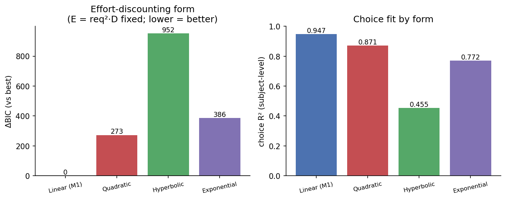

# Result 206 — Effort enters choice as linear discounting of a quadratic energy term (E = req²·D)

> **Supersedes the deprecated FET result.** An earlier version of result_206 documented an effort-discounting comparison inside the deprecated FET (effort-discounting + threat-bias) framework, where an *exponential* discount on reward won. That framework has been replaced by the joint fitness model (M1/M4). This entry re-runs the discount-form question inside the **current M1 specification** and the headline reverses: with effort held as the theory-motivated energy term `E = req²·D`, a **linear** discount fits best. See Revision notes.

## Overview

<TODO — Stage 2>

## Hypothesis

**Statement.** Within the effort-only null model M1, the function that trades reward against effort is best described by a linear discount on the energy term `E = req²·D`, rather than by a quadratic, hyperbolic, or exponential discount of the same term.

**Predicted direction.** Lowest BIC for the linear form.

**Preregistered criterion.** Exploratory — no a priori criterion. Model selection by ΔBIC (equal parameter counts across forms).

**Source of the hypothesis.** Supplemental model-selection check that motivates M1's effort term (and, through it, M4's quadratic deviation cost). Replaces the deprecated FET discount-form selection (internal H2).

## Data Source

- **Sample:** Exploratory model-input snapshot, N = 281 subjects. Built by `scripts/preprocessing/prepare_model_input.py` (which defaults to the exploratory sample) on 2026-04-04. This snapshot predates the MCMC pipeline used in [[result_201]] and carries a slightly smaller N (281) than the current exploratory N reported there (290); see Caveats.
- **Input files:**
  - `data/model_input/choice_trials.csv` — 12,645 choice trials (`subj_idx`, `distance_H`, `choice`).
  - `data/model_input/vigor_cell_means.csv` — 3,822 condition-cell mean pressing rates (`subj_idx`, `is_heavy`, `mean_rate`, `n_trials`).
  - `data/model_input/subject_mapping.csv` — 281 subjects.
- **Inclusion / exclusion applied for this result:** Whatever exclusions were active in the 2026-04-04 preprocessing run; no additional exclusions.
- **Unit of analysis:** Choice likelihood at the trial level (12,645 trials); vigor likelihood at the condition-cell-mean level (3,822 cells, intercept-only and identical across all variants).
- **N entering the model:** 12,645 choice trials + 3,822 vigor cells = 16,467 likelihood contributions, from 281 subjects.

## Method

The analysis isolates a single design question: **how should reward be discounted by effort in the choice model?** All other structure is held fixed at the M1 null specification (per-subject log-normal κ, free population softmax temperature τ, and an intercept-only "null" vigor likelihood that carries no condition structure). The effort/cost argument is fixed at the theory-motivated energy term `E = req²·D` — quadratic instantaneous press cost × duration — which is exactly M1's cost term and is consistent with M4's quadratic deviation cost. Only the **discount function** that converts `(R, E)` into an option value is varied, across four candidate forms with **equal parameter counts**, so the BIC comparison is clean. Each option's value drives a softmax choice; `ΔV = V_H − V_L` and `P(heavy) = σ(ΔV / τ)`.

**Discount-function variants (Axis B — the headline):**

```
E = req² · D            (fixed; req_H=0.9, req_L=0.4, D_H∈{1,2,3}, D_L=1 ⇒ E_H=0.81·D_H, E_L=0.16)
R_H = 5, R_L = 1

Linear (current M1) : V = R − κ·E
Quadratic           : V = R − κ·E²
Hyperbolic          : V = R / (1 + κ·E)
Exponential         : V = R · exp(−κ·E)

per-subject:  κ_i = exp(m_κ + s_κ · z_i),  z_i ~ N(0,1)
choice:       P(heavy) = σ((V_H − V_L) / τ),  τ free
vigor:        intercept-only null (identical across all four variants)
```

**Supplemental robustness check (Axis A — effort exponent on `req`):** A separate sweep varies the exponent `p` in `cost = κ·req^p·D` (discount held linear), with `p=1` (the M4 choice "total-demand" form), `p=2` (the M1 quadratic form used in Axis B), and `p` estimated freely. This sweep is secondary: it moves BIC far less than the discount-function choice and the free optimum is not interpretable (see Result).

**Model selection.** BIC = 2·(−ELBO) + k·ln(N_obs), with k = 287 parameters (281 subject κ + 6 population: m_κ, s_κ, μ_vigor, b_cookie, σ_v, τ; the free-power variant adds 1) and N_obs = 16,467. Equal k across the four Axis-B forms ⇒ ΔBIC reduces to a pure ELBO comparison.

**Software / packages:**
- NumPyro / JAX (SVI, `AutoNormal` guide, `ClippedAdam` optimizer, 35,000 steps per fit, `Trace_ELBO`).
- Environment: `effort_foraging_threat` (Python 3.11).

**Inference criterion:** Lowest BIC. Note this is an **SVI (variational) ELBO**, not an MCMC marginal likelihood; the BIC here uses the best ELBO loss as the deviance term (see Caveats).

**Script that produces this result:**
- `scripts/modeling/joint_optimal/m1_effort_kernels.py` — `run_form_sweep()` (Axis B) and `run_exponent_sweep()` (Axis A); ~12 min for all 7 fits.

## Result

Within M1, a **linear** discount on the quadratic energy term `E = req²·D` fits best, beating every alternative discount form by a large BIC margin.

**Axis B — discount function (the headline; `E = req²·D` fixed, equal parameter counts):**

| Discount form | ELBO | BIC | ΔBIC | Choice accuracy | Choice R² (subject) |
|---|---|---|---|---|---|
| **Linear (M1)** | **−8,201.8** | **19,190** | **0.0** | 70.9% | **0.947** |
| Quadratic | −8,338.0 | 19,463 | 272.5 | 69.3% | 0.871 |
| Exponential | −8,394.9 | 19,576 | 386.3 | 72.0% | 0.772 |
| Hyperbolic | −8,677.6 | 20,142 | 951.6 | 65.9% | 0.455 |

The linear form wins by ΔBIC ≈ 273 over the next-best (quadratic), ≈ 386 over exponential, and ≈ 952 over hyperbolic — all far beyond conventional decisive thresholds (ΔBIC > 10). It also has the highest subject-level choice R² (0.947). (Exponential reaches marginally higher raw accuracy, 72.0% vs 70.9%, but a much worse R² and BIC — it sharpens a few easy cells at the cost of overall calibration.)

**Axis A — effort exponent on `req` (supplemental robustness; `cost = κ·req^p·D`, discount linear):**

| req-exponent | p̂ | ELBO | ΔBIC |
| --- | --- | --- | --- |
| Linear (p=1, M4 choice form) | 1.0 | −8,242.0 | 101.0 |
| Quadratic (p=2, M1) | 2.0 | −8,201.7 | 20.5 |
| Free power | 5.24 | −8,186.6 | 0.0 |

The exponent sweep moves BIC over a ~100-point range — substantial, but the unconstrained optimum (p̂ ≈ 5.2) is an uninterpretable high power and beats the principled p = 2 (M1) form by only ΔBIC ≈ 20. The M1 quadratic form sits between the M4-style linear (p=1) and the free optimum and is the interpretable, near-optimal compromise. **Cross-axis consistency check:** the shared model — "Quadratic (p=2)" in Axis A and "Linear (M1)" in Axis B — returns ELBO −8,201.7 vs −8,201.8, agreeing to within SVI noise, confirming the two sweeps are internally coherent.

**Figure:**



Left panel: ΔBIC by discount form (lower = better), with linear (M1) the decisive winner (ΔBIC = 0 vs 273 / 952 / 386 for quadratic / hyperbolic / exponential). Right panel: subject-level choice R² by form, with linear highest at 0.947 and hyperbolic worst at 0.455. Axis A (effort exponent) is reported in the table above but, by design, not plotted — the discount-function form is the dominant source of model-selection variation.

**Verdict on prereg criterion:** Exploratory — no preregistered criterion. The linear-discount-of-`E` form is selected decisively by BIC.

## Interpretation

<TODO — Stage 2/3>

## Caveats & Limitations

<TODO — Stage 2>

## Replication

**To regenerate this result:**

```bash
# From project root. Recomputes all 7 SVI fits (Axis A + Axis B) and the figure.
/opt/anaconda3/envs/effort_foraging_threat/bin/python \
  scripts/modeling/joint_optimal/m1_effort_kernels.py
```

**Expected runtime:** ~12 min (7 SVI fits × ~100 s each at 35,000 steps).

**Expected outputs:**
- `results/stats/joint_optimal/m1_effort_kernels.csv` — Axis B (discount-form) table; the headline numbers above.
- `results/stats/joint_optimal/m1_effort_exponent.csv` — Axis A (effort-exponent) table.
- `results/figs/paper/fig_s_m1_effort_kernels.{pdf,png}` — 2-panel supplemental figure.

## References

**Related results:**
- [[result_201]] — Joint fitness model M4 (the framework whose effort term this analysis motivates).
- [[result_202]] — M4 vs effort-only M1 (the null model whose effort discount form is selected here).

**Scripts:**
- `scripts/modeling/joint_optimal/m1_effort_kernels.py`

**Notes:**
- `instructions/memory/hypotheses.md` § H2 — the deprecated FET discount-form selection this entry supersedes.
- `notebooks/_deprecated/fet_models/` — original FET analysis notebooks.

## Revision notes

- **2026-05-29:** Superseded the deprecated FET-framework version of this result (which selected an *exponential* discount on reward). Re-ran the discount-form comparison inside the current M1 specification with effort fixed as `E = req²·D`; the best-fitting form is now **linear** (ΔBIC ≈ 273 over next-best). The headline reversal reflects the framework change (FET discount-on-reward → M1 discount-of-energy-term), not a data correction. Added the Axis-A effort-exponent robustness sweep. Sample relabeled to the `data/model_input/` exploratory snapshot (N=281).
